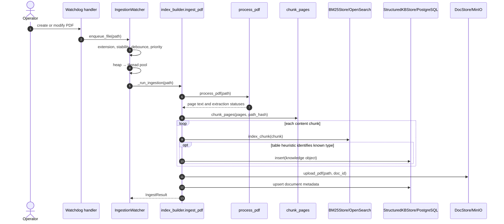

# Current ingestion sequence

```mermaid
sequenceDiagram
  autonumber
  actor Operator
  participant WD as Watchdog handler
  participant IW as IngestionWatcher
  participant B as index_builder.ingest_pdf
  participant PDF as process_pdf
  participant CK as chunk_pages
  participant OS as BM25Store/OpenSearch
  participant KB as StructuredKBStore/PostgreSQL
  participant OBJ as DocStore/MinIO
  Operator->>WD: create or modify PDF
  WD->>IW: enqueue_file(path)
  IW->>IW: extension, stability, debounce, priority
  IW->>IW: heap → thread pool
  IW->>B: _run_ingestion(path)
  B->>PDF: process_pdf(path)
  PDF-->>B: page text and extraction statuses
  B->>CK: chunk_pages(pages, path_hash)
  loop each content chunk
    B->>OS: index_chunk(chunk)
    opt table heuristic identifies known type
      B->>KB: insert(knowledge object)
    end
  end
  B->>OBJ: upload_pdf(path, doc_id)
  B->>KB: upsert document metadata
  B-->>IW: IngestResult
```

The current path has no transaction across stores. Errors after an earlier write may leave partial state.
